# 実装機能の全体アーキテクチャ

```mermaid
flowchart TB
    subgraph UserInteraction["ユーザー操作"]
        User["👤 ユーザー"]
        Commands["Commands<br/>/crit, /focus, /lint<br/>/playbook-init, /test, /rollback"]
    end

    subgraph SessionLifecycle["セッションライフサイクル"]
        direction TB
        SS["🚀 SessionStart"]
        INIT["INIT<br/>5点読込 + [自認]宣言"]
        LOOP["LOOP<br/>done_criteria 駆動開発"]
        CRITIQUE["CRITIQUE<br/>証拠ベース完了判定"]
        SE["🏁 SessionEnd"]

        SS --> INIT
        INIT --> LOOP
        LOOP -->|done_criteria達成| CRITIQUE
        CRITIQUE -->|PASS| SE
        CRITIQUE -->|FAIL| LOOP
    end

    subgraph Hooks["Hooks（構造的強制・発動率100%）"]
        direction TB
        H_SS["session-start.sh<br/>状態表示・警告・[自認]テンプレート"]
        H_IG["init-guard.sh<br/>Read強制（CONTEXT/state必須）"]
        H_PG["playbook-guard.sh<br/>session=task時playbook必須"]
        H_PE["check-protected-edit.sh<br/>CLAUDE.md等の保護"]
        H_CC["check-coherence.sh<br/>計画-状態整合性"]
        H_SE["session-end.sh<br/>未push警告"]
    end

    subgraph SubAgents["SubAgents（専門判断・独立コンテキスト）"]
        direction TB
        SA_C["critic<br/>done判定・自己報酬詐欺防止"]
        SA_PM["pm<br/>playbook作成・スコープ管理"]
        SA_SM["state-mgr<br/>focus切替・状態遷移"]
        SA_SG["setup-guide<br/>新規ユーザー案内"]
        SA_BA["beginner-advisor<br/>技術用語説明"]
        SA_R["reviewer<br/>コードレビュー"]
        SA_HC["health-checker<br/>システム健全性"]
        SA_CO["coherence<br/>commit前整合性"]
        SA_PG["plan-guard<br/>計画外作業検出"]
    end

    subgraph Skills["Skills（知識ベース・共有コンテキスト）"]
        direction TB
        SK_PM["plan-management<br/>playbook/phase操作"]
        SK_ST["state<br/>state.md操作"]
        SK_CM["context-management<br/>/compact最適化"]
        SK_EM["execution-management<br/>並列実行・タイムボックス"]
        SK_LN["learning<br/>失敗パターン記録"]
        SK_LC["lint-checker<br/>ESLint/Biome"]
        SK_TR["test-runner<br/>Jest/Vitest"]
        SK_DC["deploy-checker<br/>デプロイ準備"]
        SK_FD["frontend-design<br/>UI設計"]
    end

    subgraph TruthSources["真実源（Single Source of Truth）"]
        TS_CTX["CONTEXT.md<br/>設計思想・WHY"]
        TS_ST["state.md<br/>現在地・goal"]
        TS_CL["CLAUDE.md<br/>LLMルール"]
        TS_PB["playbook<br/>タスク計画"]
        TS_SP["spec.yaml<br/>実装詳細v8.0.0"]
    end

    %% 接続
    User --> Commands
    Commands --> SessionLifecycle

    H_SS -.->|stdout注入| SS
    H_IG -.->|BLOCK| INIT
    H_PG -.->|BLOCK| LOOP
    H_PE -.->|BLOCK| LOOP
    H_CC -.->|WARN| CRITIQUE
    H_SE -.->|リマインダー| SE

    SA_C -.->|必須| CRITIQUE
    SA_PM -.->|作成| LOOP
    SA_SM -.->|更新| LOOP
    SA_CO -.->|検証| CRITIQUE

    SK_PM -.->|参照| LOOP
    SK_ST -.->|参照| LOOP
    SK_LN -.->|記録| CRITIQUE

    TS_CTX --> INIT
    TS_ST --> INIT
    TS_CL --> INIT
    TS_PB --> LOOP
```

## 実装機能サマリー

| カテゴリ | 数 | 主要機能 |
|---------|---|---------|
| **Hooks** | 6 | session-start, init-guard, playbook-guard, check-protected-edit, check-coherence, session-end |
| **SubAgents** | 9 | critic, pm, state-mgr, setup-guide, beginner-advisor, reviewer, health-checker, coherence, plan-guard |
| **Skills** | 9 | plan-management, state, context-management, execution-management, learning, lint-checker, test-runner, deploy-checker, frontend-design |
| **Commands** | 7 | /crit, /focus, /lint, /playbook-init, /test, /rollback, /state-rollback |
