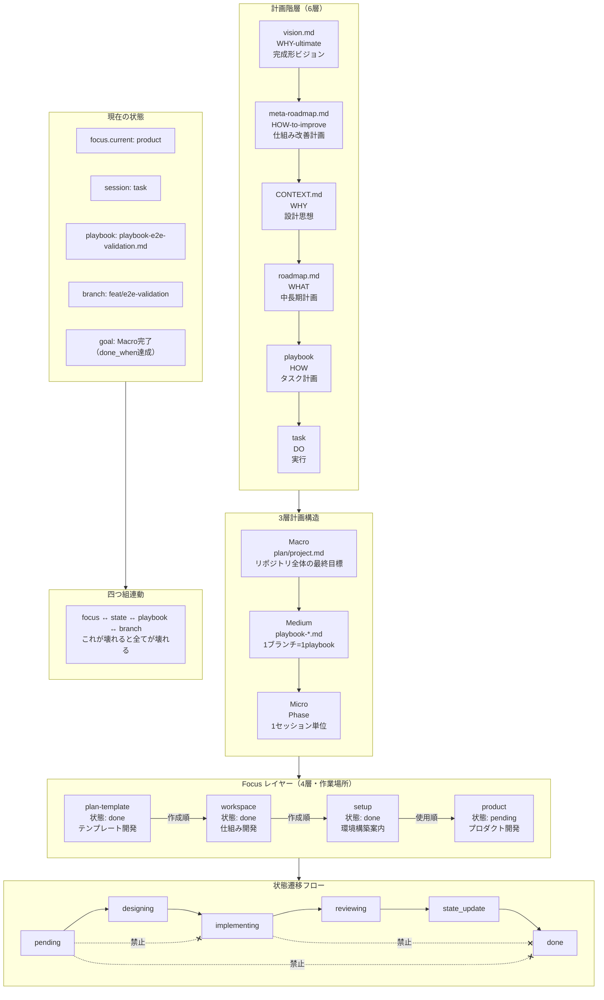

# 計画階層構造



## 計画構造の説明

### 6層計画階層

| 層 | ファイル | 役割 |
|----|---------|------|
| 1 | vision.md | WHY-ultimate: 完成形ビジョン |
| 2 | meta-roadmap.md | HOW-to-improve: 仕組み改善計画 |
| 3 | CONTEXT.md | WHY: 設計思想 |
| 4 | roadmap.md | WHAT: 中長期計画 |
| 5 | playbook | HOW: タスク計画 |
| 6 | task | DO: 実行 |

### 3層計画構造（Macro/Medium/Micro）

| 層 | 単位 | ファイル |
|----|------|---------|
| Macro | リポジトリ全体 | plan/project.md |
| Medium | ブランチ単位 | playbook-*.md |
| Micro | セッション単位 | Phase |

### 4層 Focus レイヤー

| レイヤー | 目的 | 作成順 | 使用順 | 状態 |
|---------|------|-------|-------|------|
| plan-template | テンプレート開発 | 1 | 2 | done |
| workspace | 仕組み開発 | 2 | - | done |
| setup | 環境構築案内 | 3 | 1 | done |
| product | プロダクト開発 | - | 3 | pending |

### 状態遷移

```
pending → designing → implementing → reviewing → state_update → done
```

**禁止遷移**:
- pending → implementing（designing スキップ）
- pending → done（全スキップ）
- implementing → done（state_update スキップ）
