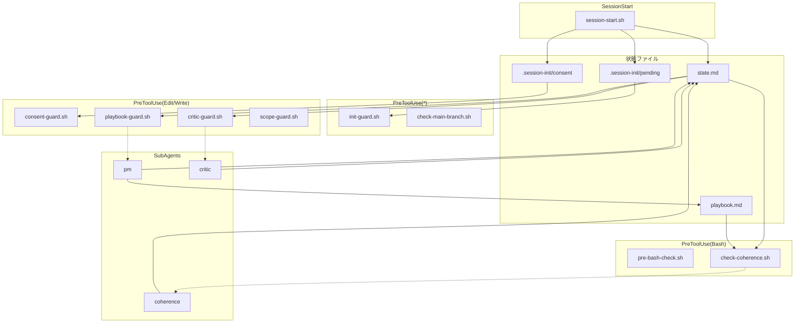

# Phase 5 成果物: 依存関係図

> **playbook-current-implementation-redesign Phase 5**
>
> 日時: 2025-12-09
> 目的: Hooks/SubAgents/Skills/Commands 間の依存関係を図で表現

---

## 1. 全体依存関係図

```
┌─────────────────────────────────────────────────────────────────────────────────────────┐
│                              依存関係マップ（全体）                                       │
└─────────────────────────────────────────────────────────────────────────────────────────┘

┌─────────────────────────────────────────────────────────────────────────────────────────┐
│                                   HOOKS                                                  │
├─────────────────────────────────────────────────────────────────────────────────────────┤
│                                                                                          │
│  SessionStart                   UserPromptSubmit              PreToolUse(*)              │
│  ┌─────────────┐               ┌─────────────┐              ┌─────────────┐             │
│  │session-start│──pending──────│prompt-guard │              │ init-guard  │             │
│  │    .sh      │   consent     │    .sh      │              │    .sh      │←──pending   │
│  └──────┬──────┘               └─────────────┘              └──────┬──────┘             │
│         │                                                          │                     │
│         │                                                          ▼                     │
│         │                                              ┌─────────────────────┐           │
│         │                                              │ check-main-branch   │           │
│         │                                              │        .sh          │           │
│         │                                              └─────────────────────┘           │
│         │                                                                                │
│         ▼                                                                                │
│  PreToolUse(Edit/Write)                                 PreToolUse(Bash)                 │
│  ┌───────────────────────────────────────────┐         ┌─────────────────────┐          │
│  │ consent-guard ──┐                         │         │  pre-bash-check     │          │
│  │ check-protected │                         │         │       .sh           │          │
│  │ playbook-guard ─┼──→ SubAgents            │         └──────────┬──────────┘          │
│  │ depends-check   │    (pm, critic)         │                    │                     │
│  │ check-file-deps │                         │                    ▼                     │
│  │ critic-guard ───┼──→ critic SubAgent      │         ┌─────────────────────┐          │
│  │ scope-guard     │                         │         │  check-coherence    │          │
│  │ executor-guard  │                         │         │       .sh           │──→ coherence │
│  └───────────────────────────────────────────┘         └─────────────────────┘          │
│                                                                                          │
│  PostToolUse(Task)              PostToolUse(Edit)               Stop                     │
│  ┌─────────────┐               ┌─────────────────┐          ┌─────────────┐             │
│  │ log-subagent│               │archive-playbook │          │stop-summary │             │
│  │    .sh      │               │      .sh        │          │    .sh      │             │
│  └─────────────┘               └─────────────────┘          └─────────────┘             │
│                                                                                          │
│  SessionEnd                                                                              │
│  ┌─────────────┐                                                                         │
│  │ session-end │←─────────────────────── .session-init/ cleanup                          │
│  │    .sh      │                                                                         │
│  └─────────────┘                                                                         │
│                                                                                          │
└─────────────────────────────────────────────────────────────────────────────────────────┘

┌─────────────────────────────────────────────────────────────────────────────────────────┐
│                                  SUBAGENTS                                               │
├─────────────────────────────────────────────────────────────────────────────────────────┤
│                                                                                          │
│  ┌──────────┐    ┌──────────┐    ┌──────────┐    ┌──────────┐    ┌──────────┐           │
│  │  critic  │    │    pm    │    │coherence │    │state-mgr │    │plan-guard│           │
│  │ (検証)   │    │(計画管理)│    │(整合性)  │    │(状態管理)│    │(計画検証)│           │
│  └────┬─────┘    └────┬─────┘    └────┬─────┘    └────┬─────┘    └────┬─────┘           │
│       │               │               │               │               │                 │
│       │               │               │               │               │                 │
│       ▼               ▼               ▼               ▼               ▼                 │
│  ┌─────────────────────────────────────────────────────────────────────────┐            │
│  │                         state.md (Single Source of Truth)               │            │
│  └─────────────────────────────────────────────────────────────────────────┘            │
│                                                                                          │
│  ┌──────────┐    ┌──────────┐    ┌──────────┐    ┌──────────┐                           │
│  │ reviewer │    │health-   │    │setup-    │    │beginner- │                           │
│  │ (レビュー)│    │checker   │    │guide     │    │advisor   │                           │
│  └──────────┘    └──────────┘    └──────────┘    └──────────┘                           │
│       ↓               ↓               ↓               ↓                                 │
│    (手動)          (手動)       (focus=setup)    (初心者検出)                            │
│                                                                                          │
└─────────────────────────────────────────────────────────────────────────────────────────┘

┌─────────────────────────────────────────────────────────────────────────────────────────┐
│                                   SKILLS                                                 │
├─────────────────────────────────────────────────────────────────────────────────────────┤
│                                                                                          │
│  ┌──────────────┐  ┌──────────────┐  ┌──────────────┐  ┌──────────────┐                 │
│  │    state     │  │plan-management│ │context-mgmt  │  │ execution-   │                 │
│  │              │  │              │  │              │  │ management   │                 │
│  └──────┬───────┘  └──────┬───────┘  └──────┬───────┘  └──────┬───────┘                 │
│         │                 │                 │                 │                          │
│         ▼                 ▼                 ▼                 ▼                          │
│  ┌─────────────────────────────────────────────────────────────────────────┐            │
│  │                   モデル呼び出し（description 照合）                      │            │
│  └─────────────────────────────────────────────────────────────────────────┘            │
│                                                                                          │
│  ┌──────────────┐  ┌──────────────┐  ┌──────────────┐  ┌──────────────┐  ┌──────────┐  │
│  │   learning   │  │frontend-     │  │lint-checker  │  │ test-runner  │  │deploy-   │  │
│  │              │  │design        │  │              │  │              │  │checker   │  │
│  └──────────────┘  └──────────────┘  └──────────────┘  └──────────────┘  └──────────┘  │
│       ↓                 ↓                 ↓                 ↓                ↓          │
│  (エラー/FAIL時)     (⚠️ 不完全)       (⚠️ 不完全)       (⚠️ 不完全)     (⚠️ 不完全)   │
│                                                                                          │
└─────────────────────────────────────────────────────────────────────────────────────────┘

┌─────────────────────────────────────────────────────────────────────────────────────────┐
│                                  COMMANDS                                                │
├─────────────────────────────────────────────────────────────────────────────────────────┤
│                                                                                          │
│  ┌────────┐  ┌──────────────┐  ┌────────┐  ┌────────┐  ┌────────┐  ┌──────────────────┐ │
│  │ /crit  │  │/playbook-init│  │ /lint  │  │ /focus │  │ /test  │  │/rollback         │ │
│  └────┬───┘  └──────┬───────┘  └────┬───┘  └────┬───┘  └────────┘  │/state-rollback   │ │
│       │             │               │           │                  └──────────────────┘ │
│       ▼             ▼               ▼           ▼                                       │
│    critic         pm           coherence    state-mgr                                   │
│                                                                                          │
└─────────────────────────────────────────────────────────────────────────────────────────┘
```

---

## 2. Hook 間の依存関係

### 2.1 session-start.sh からの依存

```
session-start.sh
       │
       ├── 作成: .claude/.session-init/pending
       │           └── init-guard.sh が参照
       │
       ├── 作成: .claude/.session-init/consent
       │           └── consent-guard.sh が参照
       │
       ├── 作成: .claude/.session-init/required_playbook
       │           └── init-guard.sh が参照
       │
       └── 更新: state.md (session_tracking.last_start)
                   └── session-end.sh が参照
```

### 2.2 init-guard.sh の依存先

```
init-guard.sh
       │
       ├── 参照: .claude/.session-init/pending
       │           └── session-start.sh が作成
       │
       ├── 参照: .claude/.session-init/required_playbook
       │           └── session-start.sh が作成
       │
       └── 削除: .claude/.session-init/pending
                   └── 必須 Read 完了時
```

### 2.3 playbook-guard.sh の依存先

```
playbook-guard.sh
       │
       ├── 参照: state.md (focus.current)
       │           └── state-mgr SubAgent が管理
       │
       ├── 参照: state.md (active_playbooks.{focus})
       │           └── pm SubAgent が更新
       │
       └── 呼び出し指示: pm SubAgent
                   └── playbook 作成
```

### 2.4 critic-guard.sh の依存先

```
critic-guard.sh
       │
       ├── 参照: state.md (verification.self_complete)
       │           └── critic SubAgent が更新
       │
       └── 呼び出し指示: critic SubAgent
                   └── done_criteria 検証
```

### 2.5 check-coherence.sh の依存先

```
check-coherence.sh
       │
       ├── 参照: state.md (focus, active_playbooks, goal)
       │           └── state-mgr SubAgent が管理
       │
       ├── 参照: playbook (meta.branch, phases)
       │           └── pm SubAgent が管理
       │
       └── 呼び出し指示: coherence SubAgent
                   └── 不整合修正
```

### 2.6 pre-bash-check.sh の依存先

```
pre-bash-check.sh
       │
       └── 呼び出し: check-state-update.sh
                   └── git commit 時のみ
```

---

## 3. SubAgent 呼び出し元

| SubAgent | Hook からの呼び出し | CLAUDE.md からの呼び出し | Command からの呼び出し |
|----------|-------------------|------------------------|----------------------|
| critic | critic-guard.sh (exit 2) | CRITIQUE セクション | /crit |
| pm | playbook-guard.sh (exit 2) | POST_LOOP セクション | /playbook-init |
| coherence | check-coherence.sh (警告) | - | /lint |
| state-mgr | - | INIT, LOOP セクション | /focus |
| reviewer | - | - | - |
| health-checker | - | - | - |
| plan-guard | - | INIT セクション | - |
| setup-guide | - | focus=setup 時 | - |
| beginner-advisor | - | 初心者質問検出時 | - |

---

## 4. Skill 参照タイミング

| Skill | トリガー | 参照元 |
|-------|--------|-------|
| state | state.md 操作時 | モデル照合 |
| plan-management | 計画キーワード検出時 | モデル照合 |
| context-management | /compact 前、80% 超過時 | モデル照合 |
| execution-management | 並列タスク開始時 | モデル照合 |
| learning | エラー/FAIL 発生時 | モデル照合 |
| frontend-design | (不完全) | - |
| lint-checker | (不完全) | - |
| test-runner | (不完全) | - |
| deploy-checker | (不完全) | - |

---

## 5. 循環依存チェック

```
循環依存: なし ✅

確認項目:
1. session-start.sh → pending → init-guard.sh → (削除) → ループなし
2. playbook-guard.sh → pm → state.md → playbook-guard.sh（参照のみ、循環実行なし）
3. critic-guard.sh → critic → state.md → critic-guard.sh（参照のみ、循環実行なし）

結論:
- 全ての依存関係は「作成→参照→削除」または「参照のみ」
- 循環実行は発生しない
```

---

## 6. 削除影響範囲

### 6.1 Hook 削除の影響

| 削除対象 | 影響を受けるコンポーネント | 機能喪失 | 復旧優先度 |
|---------|------------------------|---------|----------|
| session-start.sh | init-guard.sh, consent-guard.sh | セッション初期化、強制 Read、合意プロセス | **最高** |
| init-guard.sh | CLAUDE.md INIT | 必須 Read 強制 | **最高** |
| playbook-guard.sh | CLAUDE.md ACTION_GUARDS | playbook 強制 | **最高** |
| critic-guard.sh | CLAUDE.md CRITIQUE | 報酬詐欺防止 | **高** |
| consent-guard.sh | project.md consent_protocol | 誤解釈防止 | **高** |
| check-coherence.sh | coherence SubAgent | 整合性チェック | **中** |
| check-protected-edit.sh | protected-files.txt | ファイル保護 | **中** |
| prompt-guard.sh | project.md | スコープ確認 | **低** |
| stop-summary.sh | - | Phase サマリー | **低** |
| session-end.sh | - | セッション終了処理 | **低** |

### 6.2 SubAgent 削除の影響

| 削除対象 | 影響を受けるコンポーネント | 機能喪失 | 復旧優先度 |
|---------|------------------------|---------|----------|
| critic | critic-guard.sh, /crit | 報酬詐欺防止 | **最高** |
| pm | playbook-guard.sh, /playbook-init | playbook 管理 | **最高** |
| state-mgr | /focus | state.md 操作 | **高** |
| coherence | check-coherence.sh, /lint | 整合性修正 | **中** |
| plan-guard | - | 計画検証 | **中** |
| setup-guide | focus=setup | セットアップガイド | **低** |
| beginner-advisor | - | 初心者サポート | **低** |
| reviewer | - | コードレビュー | **低** |
| health-checker | - | 状態監視 | **低** |

### 6.3 Skill 削除の影響

| 削除対象 | 影響 | 復旧優先度 |
|---------|------|----------|
| state | state.md 操作の専門知識喪失 | **中** |
| plan-management | 計画関連操作の効率低下 | **中** |
| context-management | コンテキスト管理の効率低下 | **低** |
| execution-management | 並列実行最適化の喪失 | **低** |
| learning | 失敗学習の喪失 | **低** |
| frontend-design | (既に不完全) | **低** |
| lint-checker | (既に不完全) | **低** |
| test-runner | (既に不完全) | **低** |
| deploy-checker | (既に不完全) | **低** |

### 6.4 settings.json 削除の影響

```
settings.json 削除:
  └── 全 Hook が発火しなくなる
  └── 復旧優先度: **最高**

復旧方法:
  1. git checkout settings.json
  2. または docs/current-implementation.md から再構築
```

---

## 7. 依存関係グラフ（Mermaid）



---

## 変更履歴

| 日時 | 内容 |
|------|------|
| 2025-12-09 | Phase 5 完了。依存関係図（ASCII + Mermaid）、循環依存チェック、削除影響範囲を明記。 |

---

**作成日時**: 2025-12-09
**作成者**: Claude Code（P5 実行）
**状態**: ✅ 完了、Phase 6 へ移行可能
